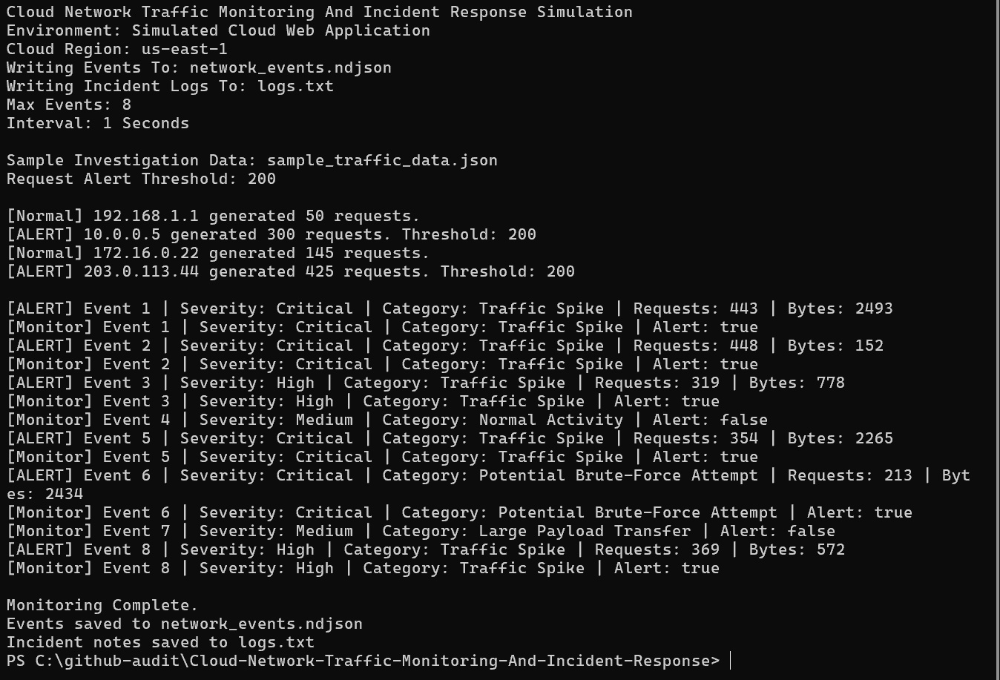

# Cloud Network Traffic Monitoring And Incident Response Simulation

## Overview

Cloud Network Traffic Monitoring And Incident Response Simulation is a C++ security monitoring prototype that simulates a cloud support scenario where network traffic must be monitored, analyzed, and investigated to detect abnormal behavior, potential security threats, and performance issues.

The project is designed to reflect how cloud support engineers, SOC analysts, and infrastructure teams review traffic patterns, identify unusual activity, and respond to incidents in production-like cloud environments.

---


---

## Dashboard Preview

The screenshot below shows the monitor running a simulated cloud traffic investigation, including request threshold checks, alert triggers, severity classification, incident categories, and completion output.



## Simulated Environment

- Cloud-Hosted Web Application
- Backend Service Generating Traffic Logs
- Users Interacting With The System
- Network Traffic Flowing Between Services
- Simulated Support Investigation Using Request Volume, Protocol Type, And Traffic Size

---

## Scenario

Users reported unusual system behavior and possible slowdowns.

As a cloud support engineer, the task was to:

- Monitor Incoming And Outgoing Traffic
- Detect Abnormal Traffic Patterns
- Investigate Potential Security Threats
- Identify High-Request Sources
- Provide Visibility Into System Activity
- Produce Structured Logs For Follow-Up Analysis

---

## Investigation Steps

- Collected Simulated Network Traffic Data
- Reviewed Sample Request Activity By IP Address
- Compared Normal Request Volume Against Alert Thresholds
- Generated Structured Monitoring Events
- Classified Traffic Severity
- Logged Alerts For Suspicious Behavior
- Produced NDJSON Output That Could Later Be Ingested By A Dashboard, SIEM, Or Log Analysis Pipeline

---

## Solution

This project implements a lightweight C++ traffic monitoring simulation that:

- Loads Monitoring Settings From A JSON Configuration File
- Reads Sample Traffic Investigation Data
- Generates Simulated Cloud Network Events
- Applies Threshold-Based Alert Logic
- Classifies Severity As Low, Medium, High, Or Critical
- Writes Structured NDJSON Event Output
- Writes Incident Notes To A Local Log File
- Prints Console Alerts When Suspicious Traffic Is Detected

---

## Outcome

- Improved Visibility Into Cloud Network Traffic Activity
- Enabled Faster Identification Of Suspicious Request Spikes
- Simulated A Real-World Incident Investigation Workflow
- Demonstrated Monitoring, Logging, Alerting, And Response Thinking
- Strengthened Practical Understanding Of Cloud Support And Security Operations

---

## Key Features

- Cloud Network Traffic Simulation
- Config-Driven Monitoring Settings
- Sample Traffic Investigation Data
- Threshold-Based Alert Triggering
- Severity Classification
- Incident Category Assignment
- Recommended Response Actions
- Structured NDJSON Event Output
- Local Incident Log Output
- Console-Based Monitoring Summary

---

## Technologies Used

- C++
- CMake
- JSON Configuration
- NDJSON Logging
- Console-Based Monitoring Output
- Threshold-Based Security Logic

---

## Project Structure

```text
Cloud-Network-Traffic-Monitoring-And-Incident-Response/
|-- main.cpp
|-- TrafficMonitor.cpp
|-- TrafficMonitor.h
|-- config.json
|-- sample_traffic_data.json
|-- CMakeLists.txt
|-- .gitignore
|-- README.md


---

## System Architecture

This project simulates a simplified cloud monitoring architecture:

- Data Source Layer: Simulated network traffic input
- Processing Layer: Traffic analysis and anomaly detection logic
- Monitoring Layer: Alert triggers, severity classification, and incident categories
- Output Layer: Console dashboard, NDJSON event logs, and incident notes

This layered structure reflects how cloud environments separate data ingestion, processing, monitoring, alerting, and operational visibility responsibilities.

---

## Example Use Case

A spike in incoming traffic from a single IP address is detected.

The system compares the request count against a configured alert threshold, flags the anomaly, assigns a severity level, categorizes the incident, and writes the event to structured output.

Example investigation flow:

- Source IP: 10.0.0.5
- Requests: 300
- Threshold: 200
- Result: Alert Triggered
- Category: Traffic Spike
- Recommended Action: Investigate traffic source and monitor for repeat activity

---

## Planned Enhancements

- Integration With Real-Time Monitoring Systems Such As Simulated CloudWatch-Style Metrics
- Alerting System With Threshold-Based Notifications
- Log Aggregation And Centralized Analysis Through An ELK-Style Simulation
- Role-Based Dashboard Views For Different Support Levels
- Automated Anomaly Detection Improvements
- Incident Ticket Generation For Escalation Workflows
- Source IP Reputation Scoring
- Exportable Incident Summary Reports

---

## Professional Positioning

This project represents an entry-level cloud support and incident response workflow simulation.

It shows the ability to monitor traffic, detect anomalies, classify incident severity, produce structured logs, and communicate investigation results clearly.

